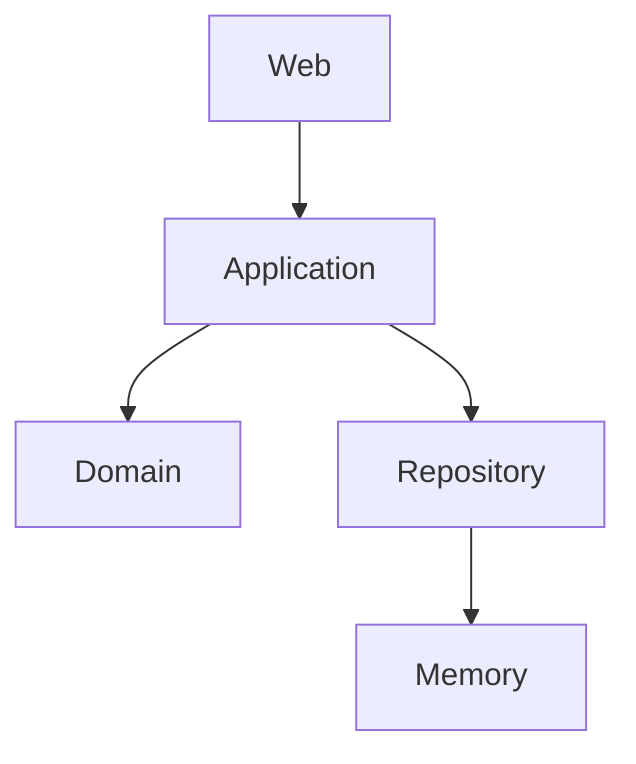

# Nucleus

A clean, modular **Spring Boot + Kotlin** example demonstrating a **modular monolith** using:

* Hexagonal Architecture (Ports & Adapters)
* Domain-Driven Design (DDD-lite)
* Strict module boundaries
* Gradle multi-module setup with build logic

---

## 🧠 Architecture Overview

This project follows a **modular monolith** approach:

```
modules/
  domain
  application
  adapter-in-web
  adapter-out-memory
app
```

### Dependency Direction

```
adapter-in-web  →
                   application → domain
adapter-out-memory →

app (composition root)
```

**Rules:**

* `domain` knows nothing
* `application` depends on `domain`
* adapters depend on `application` (and optionally `domain` for outbound)
* `app` wires everything together



---

## Why Modular Monolith?

This project intentionally avoids microservices to:

- keep complexity low
- enable fast iteration
- enforce boundaries without distribution

The architecture allows evolving into microservices later if needed.

---

## 🧩 Module Responsibilities

### `domain`

Contains the **core business model**:

* Aggregates (`Entry`)
* Value Objects (`Title`, `Content`, `Tag`, `EntryId`)
* Business rules and invariants

❗ No framework dependencies

---

### `application`

Defines **use cases and ports**.

#### Inbound Ports

Located in:

```
application.entry.port.inbound
```

Examples:

* `CreateEntryUseCase`
* `GetEntryUseCase`
* `ListEntriesUseCase`

#### Outbound Ports

Located in:

```
application.entry.port.outbound
```

Examples:

* `EntryRepository`

#### Application Services

* Implement use cases
* Orchestrate domain logic
* Map domain → result models

---

### `adapter-in-web`

Spring MVC adapter (HTTP layer).

Responsibilities:

* Accept HTTP requests
* Validate & map requests → commands
* Call inbound use cases
* Map results → responses

❗ Does NOT depend on `domain`

---

### `adapter-out-memory`

Persistence adapter.

Responsibilities:

* Implements outbound ports
* Stores domain objects

Example:

* `InMemoryEntryRepository`

---

### `app`

Composition root.

Responsibilities:

* Spring Boot application
* Wiring modules together

❗ Contains no business logic

---

## 🔄 Request Flow

Example: Create Entry

```
HTTP Request
  ↓
Controller (adapter-in-web)
  ↓
CreateEntryUseCase (inbound port)
  ↓
EntryService (application)
  ↓
Domain (Entry.create)
  ↓
EntryRepository (outbound port)
  ↓
Adapter (adapter-out-memory)
```

---

## 🧱 Design Principles

### 1. Strict Module Boundaries

* No cross-module access except via ports
* No shared mutable models

### 2. Domain Isolation

* Domain is framework-independent
* No Spring annotations in domain

### 3. Ports & Adapters

* Inbound = driving side (controllers)
* Outbound = driven side (DB, external systems)

### 4. Use Case-Centric Design

* Application layer defines behavior
* Not CRUD-centric, but use-case oriented

### 5. Read/Write Separation (Light CQRS)

* Commands → domain
* Queries → result models

---

## 🧪 Testing Strategy

### Domain

* Pure unit tests
* No framework

### Application

* Use case tests
* Fake repositories

### Web (adapter-in-web)

* `@WebMvcTest` slice tests
* No full Spring context
* Mock use cases

---

## 🛠️ Build Setup

* Gradle (Kotlin DSL)
* Multi-module build
* Custom build logic (`build-logic`)

---

## 🚀 Running the Application

```bash
./gradlew bootRun
```

---

## 📌 Example API

### Create Entry

```
POST /api/entries
```

Request body:
```json
{
    "title": "Architecture",
    "content": "Hexagonal architecture",
    "type": "ARTICLE",
    "tags": ["kotlin", "gradle"]
}
```
Response:

```json
{
  "id": "11111111-1111-1111-1111-111111111111"
}
```

```
GET /api/entries/{id}
```

### List Entries

```
GET /api/entries
```

---

## 🎯 Goals of This Project

This repository aims to be:

* A **reference implementation** for modular monoliths
* A **learning resource** for hexagonal architecture
* A **practical template** for real-world projects

---

## ⚖️ Trade-offs

* Slight duplication (DTOs per layer)
* More boilerplate than CRUD apps

✔ In return:

* Strong boundaries
* Better maintainability
* Easier evolution

---

## 📄 License

MIT
